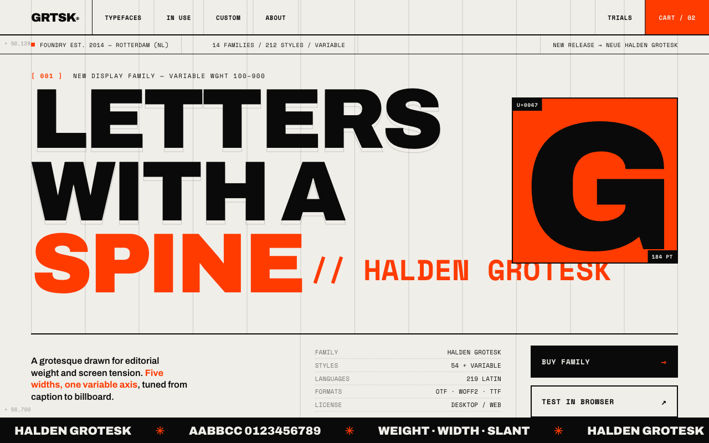
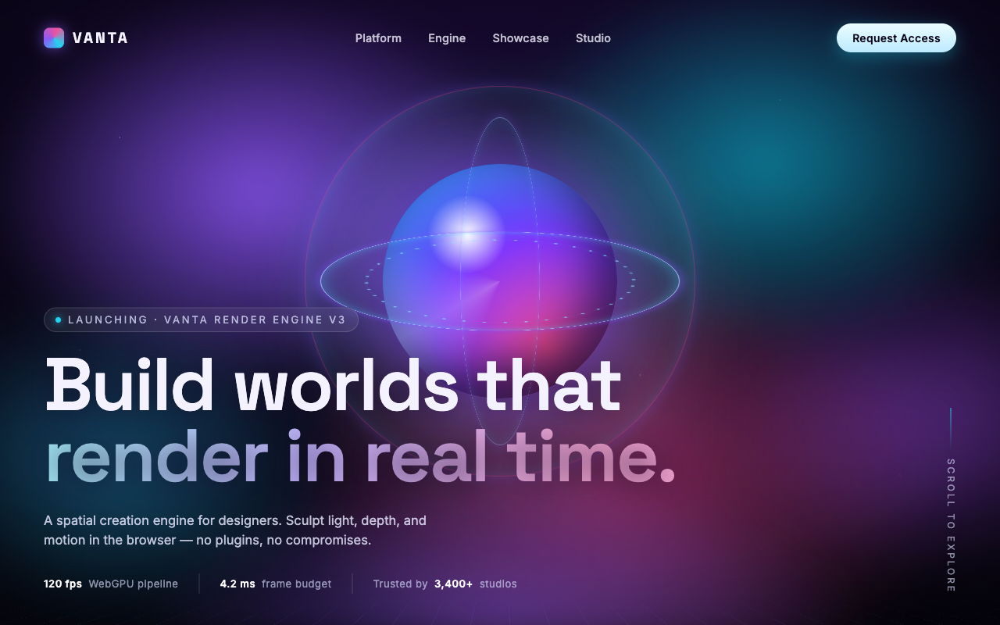
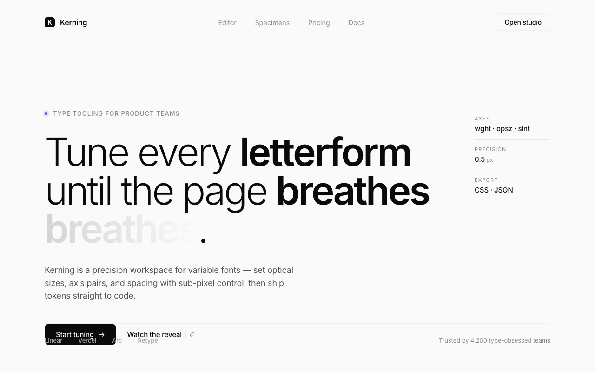
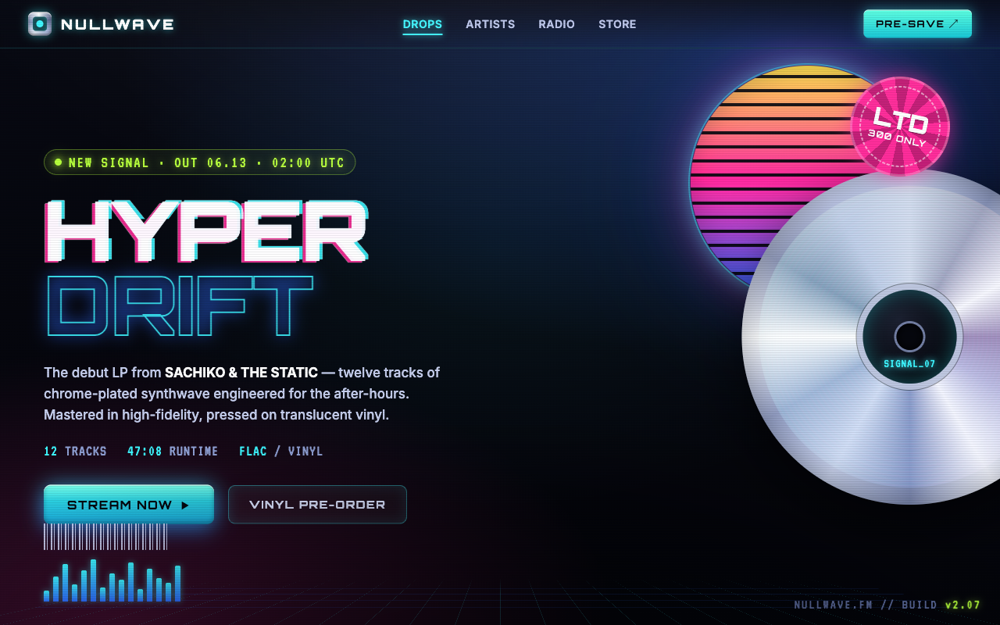
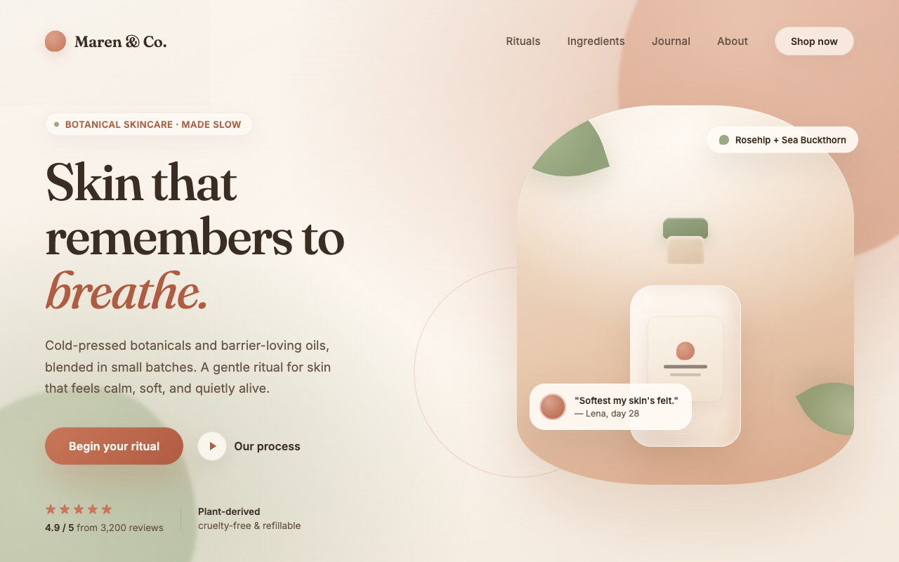

# Design-System Agent — Knowledge Base

A multi-document Markdown knowledge base that serves as the **permanent instruction set
for a specialized AI agent** whose job is to CREATE from scratch, RE-CREATE from a live
website, or MODIFY website design systems and specifications at award-winning caliber
(Awwwards / FWA / CSS Design Awards).

This is not a website. It is the agent's brain.

## Visual archetypes

The system targets six visual archetypes — you pick one as the "leaning" in your brief, and it
cascades into the type/color/spacing/motion specs. Full gallery (two rendered variants each, with
"choose for" guidance) in **[docs/archetypes/](docs/archetypes/)**.

| | | |
|:--:|:--:|:--:|
| [](docs/archetypes/README.md#brutalist-editorial) | [](docs/archetypes/README.md#immersive-3d) | [](docs/archetypes/README.md#kinetic-minimal) |
| **brutalist-editorial** | **immersive-3d** | **kinetic-minimal** |
| [](docs/archetypes/README.md#retro-futurist) | [](docs/archetypes/README.md#soft-organic) | [](docs/archetypes/README.md#luxe-cinematic) |
| **retro-futurist** | **soft-organic** | **luxe-cinematic** |

## Hub-and-spoke model

- **[knowledge-base/00-agent.md](knowledge-base/00-agent.md)** is the hub — the agent's
  system prompt: identity, quality bar, the three operating modes (`create` / `recreate` /
  `modify`), a routing table, the standard workflow, and global guardrails. It is read
  every session and stays under 150 lines.
- **Spec docs 01–10** are the spokes — loaded ON DEMAND via the hub's routing table
  (progressive disclosure). Each follows one shared template (Purpose → Core Principles →
  Decision Framework → Specifications & Parameters → Libraries → Code Examples →
  Mode-Specific Guidance → Quality Checklist → Anti-Patterns → Sources & Verification)
  and stays under 500 lines.
- **[knowledge-base/_facts.md](knowledge-base/_facts.md)** is the single source of truth
  for every library version, install command, import path, browser-support matrix, and
  spec status — all verified live on 2026-06-12. No other file may state a version on its
  own authority.
- **[knowledge-base/_conventions.md](knowledge-base/_conventions.md)** pins the shared
  template plus canonical values (mode names, easing vocabulary, motion personalities,
  duration classes, the base-8 `space.{n}` scale, token tiers) and a content-ownership map
  so each value has exactly one owning doc.
- **[knowledge-base/templates/](knowledge-base/templates/)** holds the four fill-in
  artifact skeletons the agent must emit: `design-system-spec.md`,
  `design-tokens.tokens.json` (W3C DTCG 2025.10), `motion-spec.md`,
  `implementation-plan.md`. Their schemas are canonically defined in doc 10 §§2–5.

## How it was produced (agent-team process)

1. **Phase 0 — foundation:** a deep-research workflow (113 agents, 30 sources, 25 claims
   adversarially verified 3-0) plus three targeted verification agents pinned every
   volatile fact (GSAP licensing, Lenis/Motion renames, three.js WebGPU status, View
   Transitions support, DTCG 2025.10, framework majors) into `_facts.md`; `_conventions.md`
   pinned shared values before any writer started.
2. **Phase 1 — parallel writers:** 11 writer subagents (one per doc + one for templates)
   in three batches, each doing its own topic research and consuming `_facts.md` as law.
3. **Phase 2 — review:** a dedicated reviewer audited template compliance, cross-doc
   consistency, every internal link, duplication, and verification hygiene →
   `_review-report.md` (1 BLOCKER, 13 MAJOR, 8 MINOR).
4. **Phase 3 — fix cycle:** six fix agents with disjoint file sets resolved all 22
   findings; a re-review verified each one and swept all 206 links →
   **VERDICT: PASS (0 BLOCKER / 0 MAJOR outstanding)**.
5. **Phase 4 — hub:** `00-agent.md` was written last, against the final reviewed spokes,
   then independently validated.

## Use as a Claude Code skill

A thin wrapper skill lives at `.claude/skills/design-systems-agent/SKILL.md`. It loads the hub
on demand and operates as the agent, so you invoke the whole system by describing a design task
instead of pasting a "read the hub" prompt.

- **Project-local (this repo):** already active — Claude Code discovers `.claude/skills/`.
- **Global (any project):** symlink it into your personal skills dir:
  ```bash
  ln -s "$PWD/.claude/skills/design-systems-agent" ~/.claude/skills/design-systems-agent
  ```
- **Invoke:** describe the work — e.g. *"design a system for a furniture studio portfolio,
  cinematic motion, no WebGL."* Pick a mode: `create`, `recreate` (from a URL), or `modify`.
- **Output:** four artifacts written to your project's `./design/` — design-system spec, DTCG
  tokens, motion spec, implementation plan. Build the site from those (stage two).

Note: `SKILL.md` references this knowledge base by **absolute path**. If you move the repo,
update that one path in `SKILL.md` (or repackage the KB + skill as a Claude Code plugin and use
`${CLAUDE_PLUGIN_ROOT}`).

**Building a whole site with it:** see
[docs/building-an-award-winning-website.md](docs/building-an-award-winning-website.md) — the
end-to-end playbook (brief → spec → scaffold + token bridge → build → motion → assets → verify →
ship) that turns the four artifacts into a finished, award-grade site.

## How to update / iterate

- **Re-verify versions quarterly** (or before any new project): refresh `_facts.md`
  against the npm registry and official docs, bump each touched doc's `last_verified`,
  and resolve the `UNVERIFIED — confirm before use` flags listed at the bottom of
  `_facts.md`.
- **After editing any doc:** re-run a reviewer pass over the touched files (consistency
  vs `_conventions.md` canonical values, link/anchor sweep, ≤500-line limit) and append
  the result to `_review-report.md`.
- **Never restate owned values:** check the ownership map in `_conventions.md` §4 first;
  cross-reference instead of duplicating.
- **Most likely to go stale first:** (1) npm versions in `_facts.md` §§1–2 (GSAP, Lenis,
  Motion, three.js churn monthly); (2) three.js WebGPURenderer/TSL "experimental" status
  and the R3F v10 / drei v11 alpha lines; (3) View Transitions browser support (Firefox
  cross-document is the open gap); (4) framework majors (Next/Astro/Nuxt move fast;
  Astro 7 was already in beta at verification time); (5) the DTCG spec (2025.10 is the
  first stable — expect successor TRs).

## License

Released under the [MIT License](LICENSE) — © 2026 Fabio Franco. Use, modify, and ship
freely; attribution appreciated.
