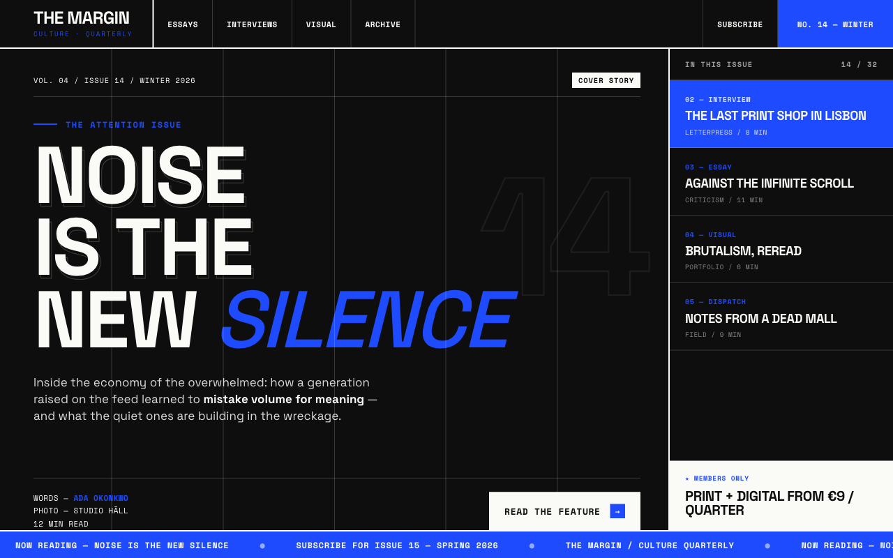
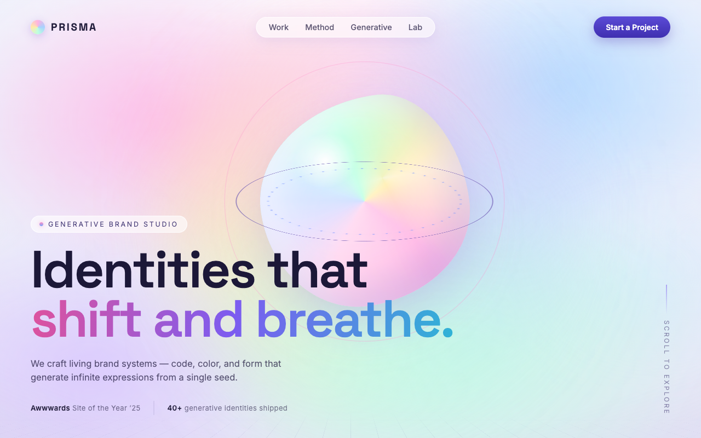
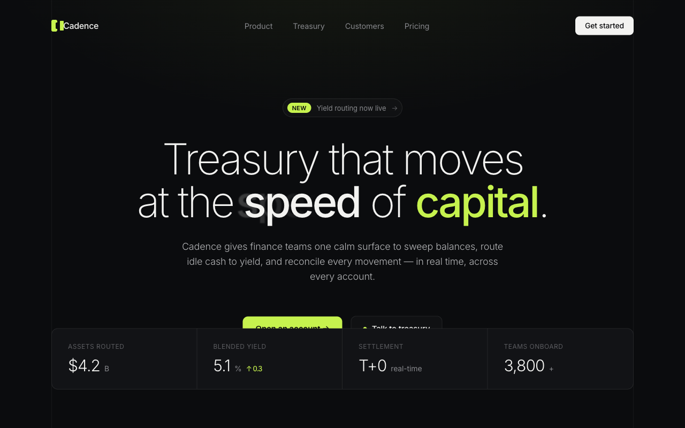
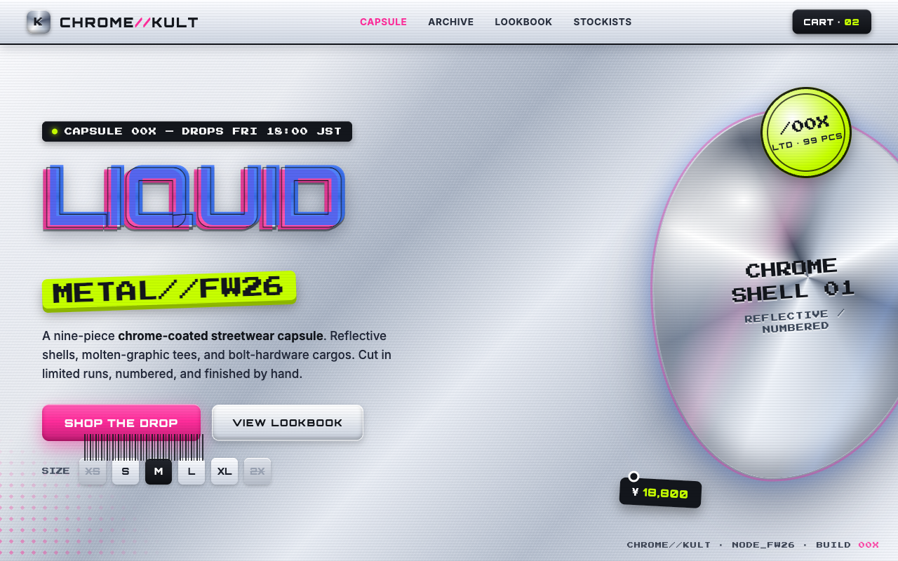
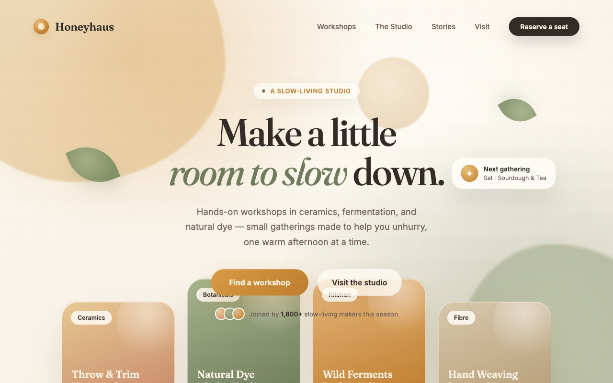
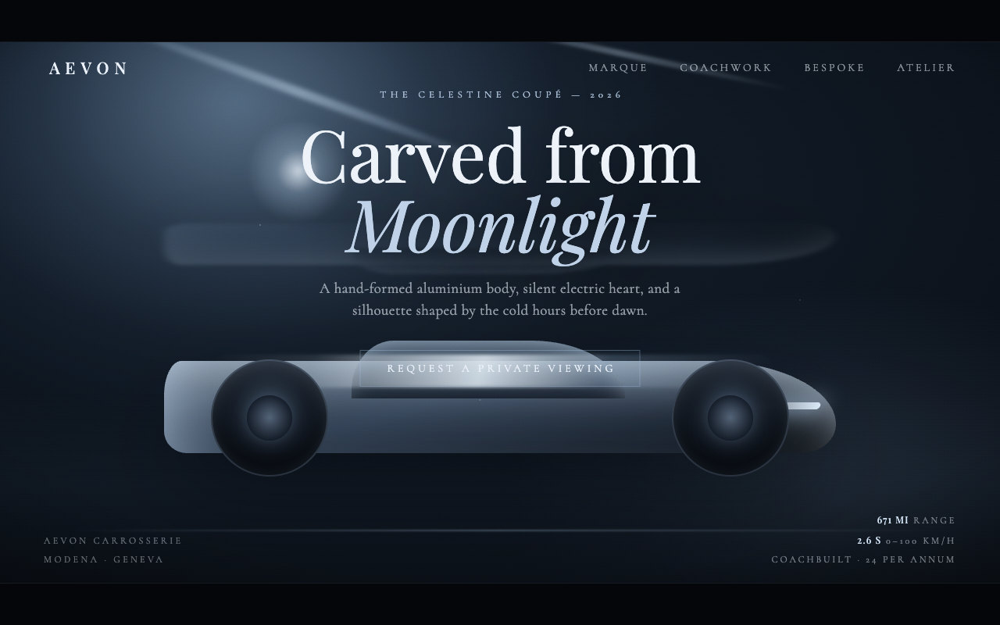

# Visual Archetype Reference Gallery

Two rendered hero mockups for each of the six canonical visual archetypes defined in
[`../../knowledge-base/01-visual-motion.md`](../../knowledge-base/01-visual-motion.md#specifications--parameters)
(the owner of the taxonomy). Use this when picking an **archetype leaning** in the brief
(Phase 0 of [building-an-award-winning-website.md](../building-an-award-winning-website.md)) —
the design-systems agent cascades the chosen archetype into the type, color, spacing, and
motion specs.

Each mockup is a **static, self-contained 1280×800 HTML hero** built to that archetype's exact
documented signals (hex ranges, display type size, borders/radii, overlay opacities), then
screenshotted — so it's a faithful illustration of the *system*, not generic AI art. The `.html`
sources sit beside this file; the previews are in `previews/`.

> Caveat: `immersive-3d` scenes here are CSS/SVG stand-ins for what a real `three.js`/WebGL build
> produces, and `luxe-cinematic` simulates the full-bleed photography/video you'd supply in a real
> build.

---

## brutalist-editorial
Exposed grid, oversized grotesque type, raw honesty, ≤3 colors + one saturated accent (display
contrast ≥ 12:1). **Default personality:** `snappy`. **Choose for:** editorial, culture, agencies,
type/statement brands, fashion-adjacent.

| ① GRTSK — type foundry | ② THE MARGIN — culture quarterly |
|---|---|
|  |  |

## immersive-3d
A real-time 3D scene IS the interface (≥ 60% of the hero), minimal UI over scene-lit depth.
**Default:** `fluid` (narrative: `cinematic`). **Choose for:** creative-tech, product reveals,
experiences — requires a WebGL performance budget.

| ① VANTA — product launch | ② PRISMA — generative studio |
|---|---|
|  |  |

## kinetic-minimal
Extreme restraint, weight-contrast typography, whitespace-dominant; motion carries the identity.
**Default:** `fluid`. **Choose for:** premium SaaS, studio portfolios, refined / understated /
crafted brands.

| ① Kerning — type tooling (near-white) | ② Cadence — fintech (near-black) |
|---|---|
|  |  |

## retro-futurist
Y2K / chrome nostalgia with modern engineering; neon, scanlines, static glitch — body stays
≥ 16 px and legible. **Default:** `snappy`. **Choose for:** music, gaming, streetwear, Gen-Z.
(Glitch loops must stay ≤ 2 Hz and die under reduced motion.)

| ① NULLWAVE — synthwave drop (dark + neon) | ② CHROME//KULT — streetwear (silver/chrome) |
|---|---|
|  |  |

## soft-organic
Warm, tactile, grain + curves, humanist type, low global contrast (text kept WCAG AA).
**Default:** `fluid`. **Choose for:** wellness, food, sustainability, community, human/warm brands.

| ① Maren & Co. — skincare | ② Honeyhaus — slow-living studio |
|---|---|
|  |  |

## luxe-cinematic
Dark, full-bleed, slow, editorial luxury; high-contrast serif, wide-tracked small caps, full-bleed
imagery as the color carrier. **Default:** `cinematic`. **Choose for:** fashion, fragrance,
automotive, film, hospitality at luxury tier.

| ① Maison Véraux — fragrance (warm gold) | ② Avelon — coachwork (cool moonlit) |
|---|---|
|  |  |

---

### Regenerating / extending

The previews were rendered by serving this folder over `localhost` and screenshotting each
`.html` at a 1280×800 viewport with a headless browser. To add or refresh a variant: edit/add the
self-contained `.html`, re-screenshot at 1280×800, and drop the PNG in `previews/`. Keep new
mockups faithful to the signal blocks in
[`01-visual-motion.md`](../../knowledge-base/01-visual-motion.md#specifications--parameters).
